# ADR 0008: Governed Relationship Assertion Contract

## Status

Accepted

## Date

2026-07-25

## Context

FarDB already persists financial assets, materializes relationship edges, and operates a rebuild and recovery
control plane. Those foundations make a governed assertion lifecycle *plausible*, but they do not yet make it a
current capability. Continuity commitment **FPC-2026-07-21-04** and strategy claims still classify the governed
relationship-assertion model as `NEXT` / `RESEARCH`.

Staging database authorization (H-P0-04 / ADR 0007) is Satisfied on `main` at
`5e45753705c10c2c4f50e0e9bc4d07b823d752ab`. The next programme milestone is therefore to **ratify** a narrow,
frozen contract before any schema or runtime work begins.

Without a ratified contract:

1. Implementation PRs would invent vocabulary, lifecycle, and projection rules ad hoc.
2. Graph edges risk remaining treated as historical authority rather than deterministic projections.
3. Claim discipline would blur: an Accepted decision could be mistaken for a CURRENT product capability.
4. A separate `control-plane-platform` prototype could be copied wholesale as a second service.

The vertical-slice seed already exists in sample data (`AAPL_BOND_2030` → `issuer_id="AAPL"`) with legacy edge type
`corporate_link`. Publication hooks already exist on the rebuild `SUCCEEDED` path. Those surfaces define where
later PRs must attach; this ADR does not change them.

## Decision

FarDB adopts the **Governed Relationship Assertion Contract v1** as the authoritative semantic contract for
relationship provenance, evidence polarity, confidence characterization, bitemporal time, lifecycle, authority,
supersession, and deterministic projection.

The frozen normative text lives at
[governed-relationship-assertion-contract-v1.md](../governance/governed-relationship-assertion-contract-v1.md).
This ADR records the architecture decision; the contract file is the binding specification. Semantic changes after
acceptance require an explicit contract-amendment ADR/PR — implementation PRs must not silently rewrite v1.

### Claim discipline

| Artefact | Claim class after this ADR |
| --- | --- |
| ADR 0008 decision + contract v1 text | **Accepted** (decision ratified) |
| Governed assertion runtime capability | Remains **NEXT** until exact-SHA staging proof (programme PR 10 / #1540); not CURRENT |

Empty assertion store ⇒ zero behavioural change. No CURRENT capability claim is authorized by this ADR alone.

### Non-negotiable invariants

1. **Assertions are truth; graph edges are projections.** `asset_relationships` and the in-memory adjacency map
   remain read models, not historical authority.
2. **Append-only history; supersession via successors.** Corrections create successor assertions; they never rewrite
   history.
3. **Bitemporal time.** `effective_from` / `effective_to` (world time) and `recorded_at` / `known_at` (system
   knowledge). Historical queries accept both `effective_at` and `known_at`.
4. **Confidence ≠ projection strength.** Confidence is optional integer basis points with declared type/method;
   projection strength is predicate-registry compatibility. `not_assessed` must be explicit — no silent defaults.
5. **No evidence bodies in v1.** Store bounded source references, SHA-256 digests, media type, timestamps, visibility
   and licensing metadata only.
6. **Pure deterministic projection.** No implicit clock, unordered DB results, random IDs, or environment-dependent
   logic inside projection.
7. **Conflicts fail closed.** Two simultaneously accepted issuer references for one bond produce a projection error —
   never last-write-wins.
8. **Publish only through the existing rebuild `SUCCEEDED` path.** A projection candidate becomes current only when
   the corresponding rebuild job is atomically marked `SUCCEEDED`.
9. **Empty assertion store ⇒ zero behavioural change.** Existing graph/API output must remain unchanged until a
   governed scope is explicitly established.
10. **Main FarDB repo only.** Narrow v1: no multi-domain model, graph-DB migration, generic AI inference, raw
    document custody, or broad RBAC redesign.

### Control-plane disposition

The earlier [`control-plane-platform`](https://github.com/DashFin-FarDb/control-plane-platform) repository:

- May contribute design ideas (policy-as-code, versioned policies, blocking decisions, append-only audit events,
  governance CI gates).
- Must **not** become a second service or a runtime dependency.
- Must **not** have its implementation or workflows copied wholesale.

**Disposition for GRAC v1:** keep all relationship truth and runtime governance in
`financial-asset-relationship-db` only; reuse policy-registry and audit-event *concepts*; keep
`control-plane-platform` private and **reference-only**. Archiving it is a separate, explicitly approved action
after GRAC v1 is verified — not part of this ADR or delivery PRs 1–10.

### Architecture sketch

```mermaid
flowchart LR
  evidence[relationship_evidence]
  assertions[relationship_assertions]
  events[relationship_assertion_events]
  projector[deterministic_projector]
  revisions[projection_revisions_edges]
  rebuild[existing_rebuild_control_plane]
  readmodel[asset_relationships_and_memory_graph]

  evidence --> assertions
  assertions --> events
  assertions --> projector
  events --> projector
  projector --> revisions
  revisions -->|"SUCCEEDED only"| rebuild
  rebuild --> readmodel
```

### Persistence posture (decision only)

v1 will add seven additive tables (`relationship_evidence`, `relationship_assertions`,
`relationship_assertion_evidence`, `relationship_assertion_events`, `relationship_projection_revisions`,
`relationship_projection_edges`, `relationship_projection_publications`). No existing table is removed or
repurposed. Schema DDL and runtime writers are **out of this ADR** and land in later programme PRs.

### First financial vertical slice

First predicate: `financial.bond.issuer_reference@1` over subject `AAPL_BOND_2030` → object `AAPL`, projecting to
legacy-compatible `corporate_link` with registry strength `0.8` (explicitly not confidence). The slice asserts
FarDB’s stored issuer reference, not an externally verified legal issuance claim.

## Consequences

### Positive

1. Implementation PRs share one frozen vocabulary, lifecycle, and projection contract.
2. Claim discipline separates Accepted decision from NEXT capability until staging proof.
3. Publication stays bound to the existing rebuild control plane rather than inventing a second authority path.
4. Empty-store compatibility preserves current graph behaviour until a governed scope is established.

### Negative

1. Contract freeze slows opportunistic semantic fixes; flaws require amendment PRs.
2. Seven-table additive model increases persistence surface before capability is CURRENT.
3. Fail-closed projection rejects ambiguous accepted conflicts that informal last-write-wins would have masked.

### Neutral

1. FastAPI + Next.js remains the production architecture (ADR 0001).
2. ADR 0007 database authorization boundary is unchanged.
3. Rebuild/recovery state-machine authority is unchanged; GRAC publishes *through* it.
4. Orthogonal Depfu dependency PRs remain out of programme scope.

## Alternatives considered

### 1. Treat existing `asset_relationships` rows as authoritative history

**Rejected.** Edges lack append-only provenance, bitemporal custody, authority events, and supersession. Promoting
them to truth would freeze an inadequate model.

### 2. Import `control-plane-platform` as a second runtime service

**Rejected.** The prototype is incomplete (placeholder policy hashes, duplicated workflows). A second service would
split relationship truth and violate “main FarDB repo only.”

### 3. Defer ratification until schema and projector land together

**Rejected.** Combined PRs would invent semantics under delivery pressure. Ratifying the contract first enables
conformance gates and file-bounded implementation PRs.

## Implementation plan

Immediate (this PR / programme PR 1):

1. Accept this ADR and land the frozen contract v1 document.
2. Record **FARDB-GRAC-V1** as Agreed in the continuity ledger; advance FPC-2026-07-21-04 next-action.
3. Add structural documentation tests that lock ADR status, claim discipline, and contract anchors.

Deferred programme sequence (merge strictly in order; rebase each branch on the preceding merge):

1. #1532 — machine-readable conformance gate
2. #1533 — additive seven-table schema (SQLite/PostgreSQL; no Alembic; no `asset_relationships` mutation)
3. #1534 — lifecycle/authority domain + repository
4. #1535 — deterministic projector + identical hashes across DBs
5. #1536 — publication through rebuild control plane
6. #1537 — command/explanation APIs + reviewer dependency
7. #1538 — explanation UI panel
8. #1539 — staging proof workflow
9. #1540 — exact-SHA evidence; only then CURRENT for proved staging scope

## Non-goals

- Runtime code, schema DDL, CI conformance JSON, API/UI, or staging workflows in this ADR’s landing PR.
- CURRENT capability claims, multi-domain expansion, graph-database migration, or raw evidence blob custody.
- Archiving `control-plane-platform` or merging orthogonal Depfu PRs.
- Mutating `asset_relationships` semantics or the rebuild state machine in this decision PR.

## References

- [Governed Relationship Assertion Contract v1](../governance/governed-relationship-assertion-contract-v1.md)
- [ADR 0001: Production architecture](./0001-production-architecture.md)
- [ADR 0007: Database authorization boundary](./0007-database-authorization-boundary.md)
- [State machine and operating authority](../governance/state-machine-and-operating-authority.md)
- [FarDB Project Continuity Ledger](../strategy/fardb-project-continuity.md)
- [Claims and truth policy](../strategy/claims-and-truth-policy.md)
- Tracker epic [#1530](https://github.com/DashFin-FarDb/financial-asset-relationship-db/issues/1530); PR 1
  [#1531](https://github.com/DashFin-FarDb/financial-asset-relationship-db/issues/1531)
