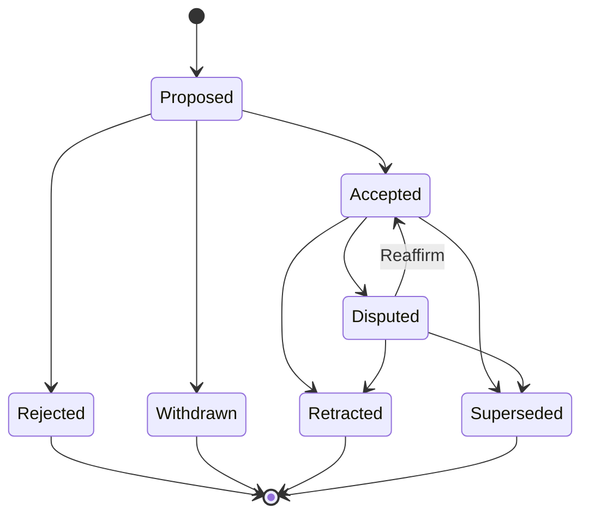

# Governed Relationship Assertion Contract v1

**Status:** Frozen normative contract (Accepted via [ADR 0008](../adr/0008-governed-relationship-assertion-contract.md))
**Claim class for runtime capability:** `NEXT` until a fresh exact-SHA seed-and-restart proof passes with workflow-bound persistence provenance and seed/restart graph parity (issue #1540)
**Contract version:** `grac.v1`
**Baseline:** `main` at `5e45753705c10c2c4f50e0e9bc4d07b823d752ab`
**Runtime impact of this document:** Documentation only. An empty assertion store must produce zero behavioural change.

This file is the binding specification for Governed Relationship Assertion Contract (GRAC) v1. ADR 0008 records
the architecture decision. Semantic changes after acceptance require an explicit contract-amendment ADR/PR —
implementation PRs must not silently rewrite this document.

---

## 1. Purpose and boundaries

FarDB stores consequential financial relationships. GRAC v1 makes those relationships:

- **explainable** (provenance, method, evidence polarity, confidence characterization);
- **evidence-bound** (digests and references, not mutable narrative alone);
- **governed over time** (lifecycle, authority, supersession, bitemporal query);
- **operationally trustworthy** (deterministic projection; publish only through rebuild `SUCCEEDED`).

### In scope for v1

- Vocabulary and object boundaries for evidence, assertions, events, revisions, edges, and publications.
- Lifecycle states, transitions, and the authority matrix for those transitions.
- Evidence metadata and confidence semantics (including explicit `not_assessed`).
- Bitemporal rules and supersession invariants.
- Deterministic projection algorithm and fail-closed conflict rules.
- Additive seven-table persistence model.
- First financial vertical slice: `financial.bond.issuer_reference@1`.
- Threat model and control-plane disposition relative to `control-plane-platform`.

### Out of scope for v1

- Multi-domain assertion model or domain packs beyond the financial slice.
- Graph-database migration or replacement of `asset_relationships` as the current read model.
- Raw evidence body / blob custody.
- Generic AI inference writing accepted graph truth.
- Broad RBAC redesign beyond the authority matrix defined here.
- Archiving `control-plane-platform` (separate, explicitly approved action after GRAC v1 is verified).

### Non-negotiable invariants

1. **Assertions are truth; graph edges are projections.**
2. **Append-only history; supersession via successors.** Corrections create successor assertions; they never rewrite history.
3. **Bitemporal time.** `effective_from` / `effective_to` (world time) and `recorded_at` / `known_at` (system knowledge).
4. **Confidence ≠ projection strength.** `not_assessed` must be explicit — no silent defaults.
5. **No evidence bodies in v1.**
6. **Pure deterministic projection.** No implicit clock, unordered DB results, random IDs, or environment-dependent logic.
7. **Conflicts fail closed.** Never last-write-wins.
8. **Publish only through the existing rebuild `SUCCEEDED` path.** A GRAC-aware rebuild publishes exactly one
   revision under its non-null, owner-matching `execution_id`.
9. **Governed scope is durable.** A successfully published `(purpose, predicate_id)` scope remains governed across
   empty-edge revisions and restart; absence of edges never retires it.
10. **Unestablished empty store ⇒ zero behavioural change.** An empty assertion store with no previously published
    governed scopes leaves the legacy graph and API output unchanged.
11. **Main FarDB repository only.** `control-plane-platform` remains private reference-only during GRAC v1.
12. **Proposal and determination authority are separate.** Reviewer determinations must not reuse the proposer
    principal.

---

## 2. Vocabulary

| Term                    | Meaning                                                                                                                                                                       |
| ----------------------- | ----------------------------------------------------------------------------------------------------------------------------------------------------------------------------- |
| **Proposition**         | A typed claim that a subject relates to an object under a versioned predicate.                                                                                                |
| **Evidence**            | An immutable reference record (URI/path, SHA-256 digest, media type, visibility, licensing). No body bytes in v1.                                                             |
| **Assertion**           | An immutable acceptance-candidate record binding proposition, method, confidence characterization, and effective time. Supersession linkage lives only on append-only events. |
| **Determination**       | The lifecycle outcome applied to an assertion (accept, reject, withdraw, dispute, retract, supersede, reaffirm).                                                              |
| **Event**               | An append-only lifecycle/authority record for one assertion transition.                                                                                                       |
| **Projection**          | A pure deterministic function from accepted assertions (+ events needed for eligibility) to candidate graph edges.                                                            |
| **Revision**            | An immutable candidate graph snapshot with content hashes.                                                                                                                    |
| **Publication**         | Append-only proof that a rebuild job marked `SUCCEEDED` published a revision into the read model.                                                                             |
| **Read model**          | `asset_relationships` and the in-memory adjacency map. Not historical authority.                                                                                              |
| **Predicate**           | Versioned registry entry (for example `financial.bond.issuer_reference@1`) defining subject/object types, method IDs, and projection strength.                                |
| **Confidence**          | Optional integer basis points with declared type and method; never silently defaulted.                                                                                        |
| **Projection strength** | Predicate-registry compatibility value for the edge type; independent of confidence.                                                                                          |
| **Supersession**        | Replacement of an assertion by a successor assertion without rewriting history.                                                                                               |
| **Authority**           | Named role or policy identity permitted to perform a transition under a policy version.                                                                                       |
| **Purpose**             | Declared use of a projected view (for example `financial_graph_current_view`).                                                                                                |
| **Governed scope**      | Durable `(purpose, predicate_id)` ownership of a read-model slice. The scope is revision metadata, not an inference from currently emitted edges.                             |

### Object boundaries

- Assertions are truth for provenance and history.
- Graph edges are projections of accepted assertions for a purpose and known-at instant.
- Evidence never embeds payload bytes in v1.
- Confidence must not be copied into projection strength fields.

---

## 3. Lifecycle and authority matrix



| State        | Terminal | Meaning                                                                                                    |
| ------------ | -------- | ---------------------------------------------------------------------------------------------------------- |
| `Proposed`   | No       | Assertion exists; awaiting determination.                                                                  |
| `Accepted`   | No       | Eligible for projection when effective/known-at windows match.                                             |
| `Rejected`   | Yes      | Authority refused the proposition.                                                                         |
| `Withdrawn`  | Yes      | Proposer cancelled before acceptance.                                                                      |
| `Disputed`   | No       | Accepted assertion challenged; not eligible for new projection until reaffirmed, retracted, or superseded. |
| `Retracted`  | Yes      | Prior acceptance withdrawn without replacement successor (or successor recorded separately).               |
| `Superseded` | Yes      | Replaced by a successor assertion.                                                                         |

`Rejected`, `Withdrawn`, `Retracted`, and `Superseded` are terminal. Resubmission always creates a **new** assertion.

### Transition event payload (required)

Every transition records, in order:

1. Monotonic event sequence for the assertion.
2. Previous state and resulting state.
3. Actor identity (bounded string).
4. Authority identity and policy version.
5. Bounded rationale (size-capped text; no evidence bodies).
6. Server-recorded UTC `recorded_at`.
7. Trace / correlation ID.
8. Successor assertion ID where the transition is supersession.

Illegal transitions must be rejected by the domain layer. Implementation PRs must encode this matrix, not invent shortcuts.

### Authority matrix

Authorities are logical roles. Mapping to JWT claims, operators, or service identities is an implementation concern
that must preserve this matrix. Missing authority fails closed.

| Transition                                               | Required authority                   | Notes                                                                                                 |
| -------------------------------------------------------- | ------------------------------------ | ----------------------------------------------------------------------------------------------------- |
| Propose (create → `Proposed`)                            | `proposer`                           | Creator becomes the assertion proposer of record.                                                     |
| Accept (`Proposed` → `Accepted`)                         | `acceptor`                           | Determining principal must differ from the proposer of record.                                        |
| Reject (`Proposed` → `Rejected`)                         | `acceptor`                           | Rejection is an authority determination.                                                              |
| Withdraw (`Proposed` → `Withdrawn`)                      | `proposer`                           | Actor must be the assertion's proposer of record; possessing the role alone is insufficient.          |
| Dispute (`Accepted` → `Disputed`)                        | `disputer`                           | Challenge does not rewrite history; it changes eligibility.                                           |
| Reaffirm (`Disputed` → `Accepted`)                       | `acceptor`                           | Restores eligibility; determining principal must differ from the proposer of record.                  |
| Retract (`Accepted`/`Disputed` → `Retracted`)            | `retractor`                          | Terminal without mandatory successor.                                                                 |
| Supersede (`Accepted`/`Disputed` → `Superseded`)         | `acceptor`                           | Requires successor assertion ID; determining principal differs from predecessor's proposer of record. |
| Append evidence link on `Proposed`/`Accepted`/`Disputed` | `proposer` or `acceptor`             | Evidence rows remain immutable; links are append-only.                                                |
| Build projection revision                                | `projector` (system)                 | Pure function; no human authority shortcut.                                                           |
| Publish revision into read model                         | rebuild control plane on `SUCCEEDED` | No alternate publish path.                                                                            |

Policy version strings are opaque bounded identifiers recorded on every event. Changing who may perform a
transition requires a new policy version and an amendment path if the matrix itself changes.

### Actor ownership and separation

- Proposal records the authenticated actor as the immutable **proposer of record**. An idempotency hit may return an
  existing assertion only after validating the current caller's authority and actor identity against that record.
- Each determination receives its own authority context and records its own actor. Implementations must not infer,
  clone, or reuse proposal authority as determination authority.
- Accept, reject, reaffirm, and supersede are reviewer determinations. Their determining actor must be a different
  principal from the assertion's proposer of record.
- Withdrawal is the inverse ownership case: the authenticated actor must match the proposer of record. A generic
  `proposer` role without actor ownership is insufficient.
- Atomic supersession receives a proposal context for the successor and a separate determining-authority context
  for successor acceptance and predecessor supersession. The contexts and principals must be distinct and both are
  recorded in their respective append-only events.

---

## 4. Evidence and confidence

### Evidence records

Each `relationship_evidence` row is immutable after insert and stores only:

- bounded source reference (URI or repository-relative path);
- SHA-256 digest of the referenced bytes (lowercase hex);
- media type;
- observed / issued timestamps when known;
- visibility classification;
- licensing / reuse metadata;
- custody / collector identity (bounded).

Evidence body bytes, scraped HTML, PDFs, and other blobs are **out of v1**. No evidence bodies are stored.

### Evidence polarity links

`relationship_assertion_evidence` links are append-only and carry polarity plus server-recorded UTC
`recorded_at` (set at insert; never client-authored). Historical `known_at` queries include a link only when
`link.recorded_at <= known_at`.

| Polarity     | Meaning                                                                    |
| ------------ | -------------------------------------------------------------------------- |
| `supporting` | Evidence tends to support the proposition.                                 |
| `opposing`   | Evidence tends to oppose the proposition.                                  |
| `contextual` | Evidence situates the proposition without asserting support or opposition. |

### Confidence vs projection strength

| Field               | Rule                                                                               |
| ------------------- | ---------------------------------------------------------------------------------- |
| `confidence_bp`     | Optional integer basis points in `[0, 10000]`, or null when not assessed.          |
| `confidence_type`   | Required when `confidence_bp` is set; forbidden to invent silent defaults.         |
| `confidence_method` | Required when `confidence_bp` is set; versioned method ID.                         |
| `confidence_status` | One of `assessed` or `not_assessed`. `not_assessed` requires `confidence_bp` null. |

Projection strength is **never** derived from confidence. Strength comes only from the predicate registry.
Confidence ≠ projection strength.

---

## 5. Bitemporal rules

| Axis                   | Fields                                                  | Meaning                                                                                             |
| ---------------------- | ------------------------------------------------------- | --------------------------------------------------------------------------------------------------- |
| World / valid time     | `effective_from`, `effective_to`                        | When the proposition applies in the financial world. `effective_to` null means open-ended.          |
| System / recorded time | `recorded_at` on assertions, evidence links, and events | When FarDB learned or recorded the fact. Server clock at write; never client-supplied as authority. |
| Query known-at         | `known_at` parameter                                    | Reconstruct what FarDB knew as of that instant. Not a persisted column.                             |

### Query contract

Historical and current queries that claim temporal correctness must accept:

- `effective_at` — select assertions whose effective window covers the instant;
- `known_at` — select only assertions, evidence links, and events with `recorded_at <= known_at`;
- resulting lifecycle state as of `known_at`.

Projection for purpose `financial_graph_current_view` uses the caller-supplied or rebuild-job-bounded
`(effective_at, known_at)` pair. The projector itself must not read wall-clock time.

---

## 6. Supersession

1. Supersession creates a successor assertion; the predecessor transitions to `Superseded` via an append-only event.
2. The supersession event’s successor assertion ID is the sole authoritative linkage. Assertion rows do not store a
   supersession pointer (no dual authority).
3. Inserting and accepting the successor assertion and appending the predecessor’s `Superseded` event MUST commit in
   the **same atomic transaction**. The request carries a successor proposal context and a distinct
   determining-authority context. On failure none of the writes is visible — no orphan successor and no superseded
   predecessor without a committed, accepted successor.
4. Predecessor proposition rows are never rewritten; only append-only events change lifecycle eligibility.
5. A superseded assertion remains queryable for historical reconstruction.
6. Cycles are forbidden: an assertion must not appear in its own successor chain.
7. At most one non-terminal accepted assertion may occupy a given conflict key (see projection) at a
   `(effective_at, known_at)` pair; violations fail closed at projection time.
8. Retraction without successor is allowed; it removes projection eligibility without inventing replacement truth.

---

## 7. Deterministic projection algorithm

Projection is a **pure** function:

```text
project(assertions,
  events_as_of_known_at,
  predicate_registry,
  previously_published_scopes,
  purpose,
  effective_at,
  known_at
)
  -> ProjectionRevision | ProjectionError
```

`assertions` is the complete assertion stream. Accepted eligibility is derived inside the projector from
`events_as_of_known_at` (step 1); callers must not pre-filter to accepted-only.
`previously_published_scopes` is loaded from the revision metadata of the latest successful publication for the
requested `purpose`, selected by `published_at DESC, rebuild_job_id DESC`; that metadata supplies the revision's
complete canonical governed-scope set. It is not reconstructed from edge rows.

### Determinism requirements

- No implicit clock, `uuid4`, random, environment variables, or unordered set iteration that affects output.
- Input assertion/event streams must be sorted by stable keys before folding (assertion ID, event sequence).
- Floating-point values must not participate in hash inputs; use decimal strings or integers from the registry.
- Identical inputs MUST produce identical revision content hashes on SQLite and PostgreSQL.
- The canonical governed-scope set participates in `projection_hash` but not `edge_set_hash`.

### Steps

1. **Select** assertions whose events as of `known_at` yield lifecycle state `Accepted`.
2. **Filter** by purpose and predicate scope registered for that purpose.
3. **Filter** by effective window covering `effective_at`.
4. **Expand** each assertion to candidate edges using the predicate registry (type, strength, direction).
5. **Group** candidates by conflict key. For `financial.bond.issuer_reference@1` the conflict key is
   `(predicate_id, subject_id)` — one accepted issuer reference per bond.
6. **Fail closed** if any conflict group contains more than one distinct object or incompatible edge — emit a
   projection error, never last-write-wins.
7. **Resolve governed scopes** as the union of `previously_published_scopes` for the purpose and the
   `(purpose, predicate_id)` scopes represented by successful candidates. A successful candidate is one whose edge
   expansion and conflict validation completed without error; any `ProjectionError` aborts the whole projection, so
   no candidate from it establishes a scope. Never subtract a scope because it emits zero edges.
8. **Materialize** ordered `relationship_projection_edges` for the revision.
9. **Hash** canonical UTF-8 JSON (sorted keys, no insignificant whitespace variance) with SHA-256. `edge_set_hash`
   covers the ordered edge set; `projection_hash` also binds provenance, projection inputs, and the ordered
   governed-scope set.
10. **Persist** revision + edges + governed scopes as a candidate. Publication is a separate step.

Disputed, rejected, withdrawn, retracted, and superseded assertions do not emit edges at that `known_at`.

### Governed-scope lifecycle

1. **Identity:** A governed scope is exactly `(purpose, predicate_id)`.
2. **Candidate declaration:** A candidate revision declares its complete, canonically sorted scope set independently
   of its edge rows.
3. **Establishment:** A previously ungoverned scope becomes established only when a candidate declaring it is
   successfully published through the rebuild `SUCCEEDED` path. Candidate persistence alone does not establish it.
4. **Persistence and restart:** Every revision stores its governed-scope set durably. Reload reads the scope set from
   revision metadata; it must never reconstruct scope from persisted edges.
5. **Empty-edge continuity:** Once established, a scope is carried into every later candidate for the same purpose,
   including revisions where dispute, retraction, supersession, effective-time filtering, or an empty assertion
   result produces no edge for that predicate.
6. **Retirement:** GRAC v1 has no implicit or runtime retirement operation. Missing assertions, missing edges,
   predicate-registry omission, restart, or failed/orphaned candidates cannot retire a scope. Retirement requires a
   future explicit contract amendment with authority, history, compatibility, and migration rules.
7. **Legacy overlay:** Legacy edges inside an established scope must not reappear merely because the governed
   revision emits zero edges. Scopes from failed, orphaned, or merely persisted candidates have no overlay authority.

### Publication

A candidate revision becomes current read-model truth only when:

1. A rebuild job is `RUNNING` and owns execution under existing repository guards with a non-null `execution_id`;
   and
2. The job is marked `SUCCEEDED` and a `relationship_projection_publications` row
   `(revision_id, rebuild_job_id, execution_id, published_at)` is inserted in the **same atomic transaction**.

For any rebuild that participates in GRAC publication:

- exactly one candidate revision is selected and exactly one publication row is committed;
- `rebuild_job_id` is unique in `relationship_projection_publications`, enforcing at most one revision per rebuild;
- publication `execution_id` is non-null and equals both the stored job execution identity and the identity supplied
  to the guarded `RUNNING -> SUCCEEDED` transition; and
- retries that need a new execution create a new rebuild job rather than attaching another revision to the prior job.

If that transaction fails, neither write is visible. The publication row is authoritative for which revision was
published for GRAC; a `SUCCEEDED` rebuild without a matching publication row did not publish a governed revision.
Legacy jobs that predate or do not enter the GRAC publication path establish and retire no governed scope.

No direct write from assertion APIs into `asset_relationships` bypassing this path is permitted in v1.

---

## 8. Additive persistence model (seven tables)

Seven additive tables; no existing table is removed or repurposed in v1:

| Table                                  | Responsibility                                                         |
| -------------------------------------- | ---------------------------------------------------------------------- |
| `relationship_evidence`                | Immutable evidence reference, digest, custody and visibility metadata  |
| `relationship_assertions`              | Immutable proposition, method, confidence, and effective time          |
| `relationship_assertion_evidence`      | Supporting, opposing or contextual evidence links with `recorded_at`   |
| `relationship_assertion_events`        | Ordered lifecycle and authority history                                |
| `relationship_projection_revisions`    | Deterministic candidate revisions, hashes, and durable governed scopes |
| `relationship_projection_edges`        | Materialized governed edges for each revision                          |
| `relationship_projection_publications` | One-per-rebuild proof binding a revision to its succeeded execution    |

Schema DDL lands in programme PR 3 (#1533). Migrations must preserve SQLite/PostgreSQL parity, must not use
Alembic for this programme path unless a later ADR says otherwise, and must not mutate `asset_relationships`
row semantics as historical authority.

---

## 9. Financial vertical slice: `financial.bond.issuer_reference@1`

| Field                  | Value                                                                                 |
| ---------------------- | ------------------------------------------------------------------------------------- |
| Predicate              | `financial.bond.issuer_reference@1`                                                   |
| Subject                | `AAPL_BOND_2030`                                                                      |
| Object                 | `AAPL`                                                                                |
| Proposition            | The bond’s `issuer_id` references the `AAPL` asset record                             |
| Method                 | `bond.issuer_id.resolution@1`                                                         |
| Evidence               | Canonical digest of the committed sample record (reference only)                      |
| Projection edge        | `AAPL_BOND_2030` → `AAPL`                                                             |
| Legacy-compatible type | `corporate_link`                                                                      |
| Registry strength      | `0.8` (explicitly not confidence)                                                     |
| Purpose                | `financial_graph_current_view`                                                        |
| Claim scope            | FarDB’s stored issuer reference — **not** an externally verified legal issuance claim |

### Slice proof obligations (programme completion)

The slice must eventually prove, after restart, for an exact deployed SHA:

1. Proposal and acceptance by distinct recorded principals under the authority matrix.
2. Projection and publication through rebuild `SUCCEEDED`.
3. Evidence explanation with polarity.
4. Supersession by refreshed evidence / successor assertion.
5. Historical reconstruction via `effective_at` + `known_at`.
6. Invalid-transition rejection.
7. Answers to the programme completion questions in §12.

---

## 10. Threat model (v1)

| Threat                                     | Mitigation                                                                         |
| ------------------------------------------ | ---------------------------------------------------------------------------------- |
| Silent rewrite of relationship history     | Append-only tables; supersession via successors; no in-place proposition mutation. |
| Last-write-wins ambiguity                  | Fail-closed projection on conflict keys.                                           |
| Confidence smuggled as edge strength       | Separate fields; registry-owned strength; docs/tests forbid conflation.            |
| Clock-skewed / nondeterministic projection | Pure projector; no wall clock; stable ordering; cross-DB hash identity tests.      |
| Unauthorized acceptance                    | Actor-bound authority; determining principal differs from proposer; event audit.   |
| Bypass publish path                        | Publication only via rebuild `SUCCEEDED` + publication row.                        |
| Multiple revisions published by one job    | Unique publication `rebuild_job_id`; non-null owner-matching `execution_id`.       |
| Empty-edge legacy reappearance             | Durable scopes carried across empty revisions; no implicit v1 retirement.          |
| Evidence body exfiltration / custody creep | No evidence bodies in v1; digests and bounded references only.                     |
| Second control-plane service drift         | Main FarDB repository only; `control-plane-platform` reference-only.               |
| Premature CURRENT claims                   | Claim discipline: Accepted decision ≠ CURRENT capability until #1540.              |
| Empty-store behaviour change               | Invariant: no assertions ⇒ existing graph/API output unchanged.                    |

This threat model does not replace ADR 0007 database authorization, release evidence, or DR rehearsal gates.

---

## 11. Control-plane disposition

The earlier [`control-plane-platform`](https://github.com/DashFin-FarDb/control-plane-platform) repository:

- May contribute design ideas (policy-as-code, versioned policies, blocking decisions, append-only audit events,
  governance CI gates).
- Must **not** become a second service or a runtime dependency.
- Must **not** have its implementation or workflows copied wholesale.

During GRAC v1, keep all relationship truth and runtime governance in `financial-asset-relationship-db`.
Keep `control-plane-platform` private and **reference-only**. Archiving or marking it superseded is a separate,
explicitly approved action after GRAC v1 is verified.

---

## 12. Programme completion test

GRAC v1 is complete only when FarDB can answer, for one current governed graph edge:

1. Who proposed this relationship
2. What exact proposition was asserted
3. Which evidence supports or opposes it
4. Which method produced it
5. How confidence was characterized
6. When it was effective
7. When FarDB learned it
8. Who had authority to accept it
9. What it superseded
10. Which graph revision projected it
11. What the graph looked like before the correction

It must answer that after a restart, for an exact deployed SHA, without mutable history or nondeterministic
projection.

---

## 13. Amendment rule

If implementation exposes a semantic flaw in this contract:

1. Stop the implementation PR.
2. Open a contract-amendment PR that updates this file and, when the decision changes, ADR 0008 or a successor ADR.
3. Only then resume implementation against the amended contract.

Do not silently rewrite v1 inside schema, projector, API, UI, or staging PRs.

### Amendment log

- **2026-08-06 promotion evidence withdrawn pending hardened rerun:** The earlier
  seed and restart runs established useful staging evidence but did not retain
  workflow-bound persistence provenance or an immutable seed-side graph
  baseline. Runtime capability therefore remains `NEXT`. The staging proof
  workflow and checker were hardened to retain detailed health evidence and
  compare assertion count, edge count, and canonical edge-set hash across
  restart. A fresh strict seed-and-restart proof is required before promotion
  to `CURRENT`.
- **2026-07-26 pre-publication amendment:** Against reviewed `main` at
  `0a72dfee67aae4ef7cc44041347474a6a6e234cd`, defined governed-scope establishment, durable carry-forward, and
  no-retirement behavior; pinned one-revision-per-rebuild publication with non-null execution identity; and made
  proposal/determination actor separation normative. Runtime capability remains `NEXT`, and issue #1536 stays
  paused until the corrective lifecycle and hosted-schema proofs land.
- **2026-07-25 (`grac.v1`):** Frozen exact-SHA specification published for staging deployment.

---

## References

- [ADR 0008: Governed Relationship Assertion Contract](../adr/0008-governed-relationship-assertion-contract.md)
- [ADR 0001: Production architecture](../adr/0001-production-architecture.md)
- [ADR 0007: Database authorization boundary](../adr/0007-database-authorization-boundary.md)
- [State machine and operating authority](./state-machine-and-operating-authority.md)
- [Claims and truth policy](../strategy/claims-and-truth-policy.md)
- [FarDB Project Continuity Ledger](../strategy/fardb-project-continuity.md)
- Tracker epic [#1530](https://github.com/DashFin-FarDb/financial-asset-relationship-db/issues/1530)
