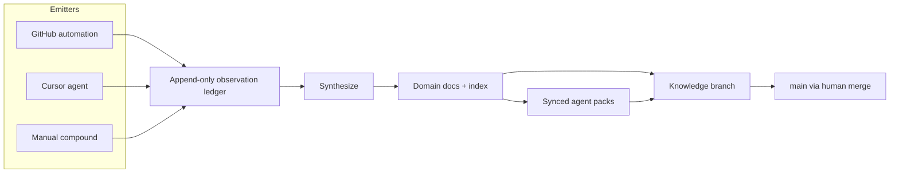
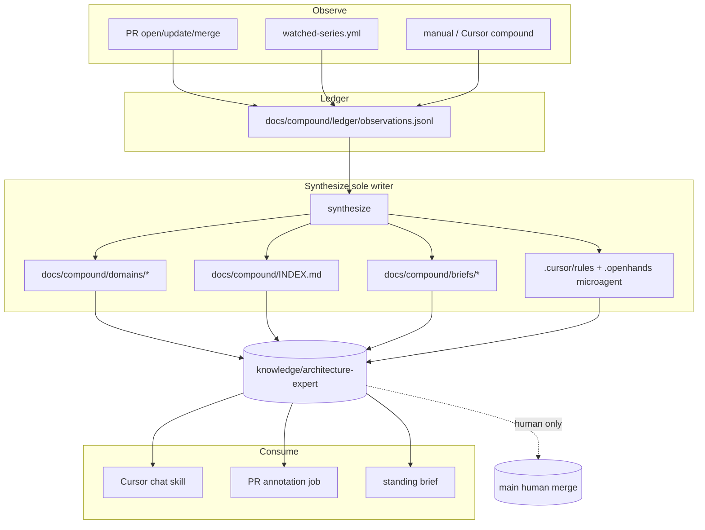

## Architecture Expert Agent - Plan

## Goal Capsule

- Objective: Compound durable, docs-first expertise on architecture, seams, boundary integrity, API, schema/SQL, and related enterprise surfaces from PRs, issues, and docs — then use that memory for chat, PR annotations, and standing briefs across a multi-branch PR swarm.
- Product authority: Product Contract below; existing ADRs and `.github` policy docs remain human-owned canon for policy.
- Open blockers: None. Deferred operational forks resolved in Planning Contract assumptions and KTDs.

## Product Contract

### Summary

Build a compounding architecture expert that continuously observes PRs, issues, and docs into an append-only observation ledger, then near-live synthesizes domain-partitioned durable docs on a dedicated knowledge branch, with agent packs synced from those docs. Cursor and GitHub both emit observations; synthesize owns canon.
Primary use is knowledge compounding; secondary uses are PR review and PR-series co-pilot. Consumption weighting: durable docs 50%, chat 25%, PR annotations 20%, standing briefs 15%.

### Problem Frame

The repository already has orientation (`AGENTS.md`), ADRs, enterprise-readiness docs, automation guardrails, PR Agent, and OpenHands microagents, but no durable agent that compounds architecture and seam knowledge from the live PR/issue stream.
Work spans many branches at once (e.g. PR #1390 docstring baseline alongside formatting, env-setup, and dependency PRs), so generic reviewers and one-shot chat lack shared, provisional-vs-landed memory of seams, API contracts, persistence/SQL, rebuild/reconciliation, and CI/guardrails.

### Key Decisions

- **Knowledge compounder first.** Reviewer and PR-series co-pilot are secondary modes that consume the same memory.
- **Docs-first source of truth.** Human-readable docs under the repository docs tree are canonical; agent packs (rules/skills/orientation) are generated or synced from them.
- **Continuous compound primary, bootstrap secondary.** A one-time bootstrap seeds history; ongoing updates are the default operating mode.
- **All four update triggers.** Merge to `main` (landed canon), PR open/update (provisional), watched open series, and manual compound commands.
- **Knowledge branch write path.** Synthesized docs and synced agent packs auto-commit to a dedicated knowledge branch; humans merge to `main`. Never auto-merge.
- **Full enterprise surface in v1.** Architecture/seams, API contracts, persistence/SQL, CI/guardrails, rebuild/reconciliation, deployment/readiness.
- **Append-only ledger → synthesize.** Cursor and GitHub both emit observations; a separate synthesize step rebuilds canonical domain docs and the index. Emitters do not edit canon directly.
- **Near-live synthesize + domain partitioning (B+C).** Synthesize soon after observations for freshness; output is domain-partitioned docs plus a thin index, not one mega-doc.
- **Dual runtime with hybrid backup.** Cursor-native and GitHub-native are both first-class emitters/consumers; fall back to docs-first hybrid (GitHub owns continuous compound, Cursor consumes) if dual ownership fails.
- **Policy and provisional integrity.** Do not silently rewrite ADRs/policy as fact (propose/annotate only). Do not treat open-PR seams as canon until merge or explicit promotion. Do not replace existing reviewers (additive only).

### Actors

- **Maintainer (you)** — Runs manual compound, watches the knowledge branch, merges when trusted, steers watched PR series.
- **Cursor agent** — Chat expert, on-demand deepen, PR-series co-pilot, optional observation emitter.
- **GitHub automation** — Emits on merge / PR open-update / scheduled or event-driven sweeps; may run synthesize.
- **Existing reviewers** — PR Agent, Bugbot, Greptile, and similar remain; this agent adds architecture memory and optional annotations.
- **Downstream agents** — Load synced agent packs derived from docs for orientation.

### Key Flows

1. **Bootstrap** — One-time pass over existing PRs, issues, and docs emits historical observations; synthesize produces initial domain docs + index + agent-pack sync on the knowledge branch.
2. **Continuous observe** — On merge, PR open/update, watched-series change, or manual command, emitters append observations (with landed vs provisional status).
3. **Near-live synthesize** — Synthesize consumes new observations, updates domain docs and index, syncs agent packs, auto-commits to the knowledge branch.
4. **Consume** — Chat answers from docs/packs; PR annotations and standing briefs cite the same memory; humans merge the knowledge branch when ready.
5. **Conflict / dual-writer failure** — If Cursor+GitHub dual ownership becomes unreliable, fall back to GitHub-as-continuous-writer and Cursor-as-consumer (docs-first hybrid backup).



### Requirements

**Compounding and memory**

- R1. The system compounds knowledge from PRs, issues, and docs into durable repository docs that cover the full enterprise surface listed in Key Decisions.
- R2. Observations are append-only and carry landed vs provisional status so open-PR knowledge cannot silently become canon.
- R3. A synthesize step is the only writer of canonical domain docs, the index, and synced agent packs.
- R4. Continuous compounding is the default; a bootstrap pass seeds initial memory from existing history.
- R5. Updates are triggered by merge to `main`, PR open/update, watched open series, and manual compound commands.

**Docs-first and agent packs**

- R6. Durable docs are the source of truth; agent packs are derived or synced from those docs, not the reverse.
- R7. Synthesized output is domain-partitioned with a thin index that supports cross-seam questions.
- R8. ADRs and policy documents remain human-owned; the agent may propose or annotate but must not silently rewrite them as fact.

**Write path and runtime**

- R9. Synthesized updates auto-commit to a dedicated knowledge branch; promotion to `main` is always human-driven.
- R10. Cursor-native and GitHub-native both emit and consume; if dual ownership fails, fall back to GitHub continuous compound with Cursor consuming docs/packs.
- R11. Near-live synthesize keeps memory fresh for the PR swarm without requiring emitters to edit the same Markdown files.

**Consumption modes**

- R12. Consumption weighting for v1: durable docs ~50%, chat expert ~25%, PR annotations ~20%, standing briefs ~15%.
- R13. Chat answers architecture, seams, boundary integrity, API, schema/SQL, and related enterprise questions from compounded memory.
- R14. PR annotations and PR-series co-pilot use the same memory and distinguish provisional vs landed context.
- R15. Standing briefs summarize what changed and which seams moved across the watched PR set.
- R16. The agent is additive to existing reviewers; it does not replace PR Agent, Bugbot, Greptile, or equivalent.

**Defaults for deferred operational forks**

- R17. Unless planning chooses otherwise: hot-path near-live synthesize covers merges, watched series, and manual compound; high-churn bulk PRs (e.g. dependency bots) are batched rather than every-event synthesize.
- R18. Unless planning chooses otherwise: bootstrap is a bounded seed sufficient for continuous compound to take over, not an exhaustive historical archive.

### Acceptance Examples

- AE1. When a watched open PR proposes a new persistence seam, the knowledge branch records it as provisional; chat and annotations label it provisional until merge or explicit promotion.
- AE2. When that PR merges to `main`, a subsequent synthesize promotes the observation to landed canon in the relevant domain doc and refreshes the synced agent pack.
- AE3. When Cursor and GitHub both emit about the same PR event, canon changes only via synthesize from the ledger — no conflicting direct edits to the same doc section.
- AE4. When the agent encounters an ADR/policy topic, it cites or proposes annotation rather than rewriting the policy doc as if it owned it.
- AE5. When a Dependabot-style PR updates without being on the watched hot path, observations may append immediately but synthesize may batch; watched-series and merge events still near-live synthesize.
- AE6. When a user asks in chat where graph rebuild persistence ownership lives, the answer comes from compounded docs/packs and names provisional vs landed sources when relevant.

### Success Criteria

- Fewer wrong-seam mistakes when humans or agents touch boundaries, API, or persistence/SQL.
- Faster orientation when opening any PR in the multi-branch swarm (what it touches; provisional vs landed).
- Knowledge-branch docs are accurate enough that maintainers are willing to merge them.
- Architecture/seams annotations catch real issues that generic reviewers miss.
- Equal weight across those four signals for calling v1 successful.

### Scope Boundaries

**In scope (v1)**

- Observation ledger, near-live synthesize, domain-partitioned docs + index, agent-pack sync, knowledge branch auto-commits.
- Bootstrap + continuous compound; all four triggers.
- Chat, PR annotations, standing briefs, PR-series co-pilot as consumers.
- Full enterprise surface listed above.

**Out of scope (v1)**

- Auto-merging the knowledge branch to `main`.
- Replacing or disabling existing PR review bots.
- Treating open-PR content as landed canon without merge or explicit promotion.
- Silent ownership of ADRs / automation policy docs.
- Building a general-purpose company-wide knowledge base outside this repository’s architecture and enterprise surfaces.

### Dependencies / Assumptions

- Existing orientation and policy remain inputs: `AGENTS.md`, `docs/adr/*`, `docs/enterprise-readiness-index.md`, `.github/AUTOMATION_SCOPE_POLICY.md`, `.github/AI_AGENT_GUARDRAILS.md`, seam docs such as `docs/graph-persistence-lifecycle-seam.md` and `docs/reconciliation-discovery-map.md`.
- PR Agent / OpenHands / similar continue to operate independently.
- Active multi-PR context includes at least PR #1390 (`codex/precommit-docstring-baseline`) among other open branches; the agent must tolerate parallel unrelated PRs.
- `CONCEPTS.md` does not exist at repository root today; vocabulary capture into `CONCEPTS.md` is not required for this brainstorm artifact.

### Outstanding Questions

**Deferred to Planning** — resolved in Planning Contract (see Assumptions and KTDs). Residual implementation-time unknowns remain under Open Questions there.

### Sources / Research

- Confirmed present: `AGENTS.md` (Dosu), `docs/adr/0001-production-architecture.md` (and 0002–0005), `docs/enterprise-readiness-index.md`, `.github/AUTOMATION_SCOPE_POLICY.md`, `.github/AI_AGENT_GUARDRAILS.md`, `.github/pr-agent-config.yml` / `.github/workflows/pr-agent.yml`, `.openhands/microagents/*`, `docs/graph-persistence-lifecycle-seam.md`, `docs/reconciliation-discovery-map.md`.
- Confirmed absent: dedicated architecture-expert compounder; root `CONCEPTS.md`; `docs/solutions/` tree.
- Confirmed context: open PR #1390 on `codex/precommit-docstring-baseline`; local checkout may differ (e.g. `pr1364-merge`).
- Prior art: `.elastic-copilot/memory/*` + `scripts/validate_manifest.py` (append-prone memory with CI validation — avoid duplicate-section failure mode); `docs/lessons/automation-scope-drift-recovery.md` (do not format over corrupted structural docs); Frogbot/autofix write-back patterns for branch commits with split permissions.

---

## Planning Contract

### Assumptions

- A1. Knowledge branch name is `knowledge/architecture-expert`.
- A2. Durable compound tree lives under `docs/compound/` (dedicated tree, not `docs/solutions/` and not rewriting enterprise spokes in place).
- A3. Observation ledger is append-only JSONL under `docs/compound/ledger/observations.jsonl` (plus optional rotated shards if size warrants later).
- A4. Domain partitions are: `architecture`, `api`, `persistence`, `ci-guardrails`, `rebuild-reconciliation`, `deployment` — each a Markdown doc under `docs/compound/domains/`, plus `docs/compound/INDEX.md`.
- A5. Agent packs sync to sidecars only: `.cursor/rules/architecture-expert.mdc` and `.openhands/microagents/architecture_expert.md`. Never overwrite Dosu-maintained `AGENTS.md`.
- A6. Standing briefs are durable Markdown under `docs/compound/briefs/` on the knowledge branch (not chat-ephemeral).
- A7. Watched series is configured in `docs/compound/watched-series.yml` (PR numbers and/or labels and/or path globs).
- A8. Hot-path near-live synthesize: merges to `main`, watched-series events, manual `workflow_dispatch` / Cursor compound.
  Dependency-bot and similar bulk PRs append observations immediately but synthesize on a batch schedule (or when a merge/watched/manual event also fires).
- A9. Bootstrap v1: (1) seed observations from existing ADRs, seam docs, enterprise-readiness index, and guardrail docs; (2) bounded scrape of recent open + recently merged PRs (default: last 30 days or last 50 PRs, whichever is smaller). Not an exhaustive archive.
- A10. GitHub synthesize job alone has `contents: write` scoped to pushing `knowledge/architecture-expert`. Emitter/comment jobs stay `contents: read` (+ `pull-requests: write` only for annotations).
- A11. Path allowlist for automated writes: `docs/compound/**`, `.cursor/rules/architecture-expert.mdc`, `.cursor/rules/architecture-expert-query.mdc`, `.openhands/microagents/architecture_expert.md`.
  Explicit denylist (closed list in shared constants): `docs/adr/**`, `AGENTS.md`, `.github/AUTOMATION_SCOPE_POLICY.md`, `.github/AI_AGENT_GUARDRAILS.md`, `.github/copilot-instructions.md`, `docs/PR_SCOPE_GUARDRAILS.md`, `docs/GOVERNANCE.md`, `docs/DEPENDENCY_POLICY.md`, `docs/lessons/**`.
- A12. Dual-writer failure signal (hybrid backup): store mode in `docs/compound/runtime.yml` (`writer_mode: dual|github_only`).
  Auto-flip to `github_only` when synthesize records ≥3 push conflicts or divergent ledger tips within 30 minutes (counter in runtime.yml).
  In `github_only`, Cursor continuous emit no-ops with an explicit message; Cursor may still append only by opening a PR / `workflow_dispatch` that lands through GitHub; consume docs/packs from the knowledge branch.

### Key Technical Decisions

- KTD1. **Ledger is the conflict boundary.** Emitters only append observation records (idempotent by `observation_id` / source event key). Synthesize is the only process that rewrites domain docs, index, briefs, and packs.
- KTD2. **Observation schema (directional).** Each record includes: `observation_id`, `source` (`github`|`cursor`|`manual`|`bootstrap`), `event_type`, `status` (`provisional`|`landed`), `refs` (PR/issue/commit/paths), `domains[]`, `summary`, `evidence_pointers[]`, `created_at`. Deduplicate on `(source, event_type, primary_ref)`.
- KTD3. **Synthesize is deterministic enough to re-run.** Rebuilding domain docs from the full ledger (or from a watermark + delta) must be safe; prefer regenerate-from-ledger over ad-hoc section edits so Elastic-Copilot-style duplicate headings do not recur.
- KTD4. **Extend existing automation patterns.** GitHub workflow event surface and concurrency mirror `.github/workflows/pr-copilot.yml`; write-back permissions mirror Frogbot/autofix split (read vs write jobs). Do not replace PR Agent / PR Copilot.
- KTD5. **Primitive agent actions, not one opaque bot.** Cursor skill(s) and GH jobs expose: append observation, run synthesize, query memory, post PR annotation, write standing brief, sync packs. Prompts own judgment; tools own I/O.
- KTD6. **Docs-first packs.** Pack generation is a pure transform from `docs/compound/INDEX.md` + domain docs into sidecar rule/microagent text, including mandatory branch/ref verification language borrowed from `AGENTS.md` / `.github/copilot-instructions.md`.
- KTD7. **Additive PR annotations.** Annotation comments are clearly labeled as architecture-expert memory (provisional vs landed). They never auto-approve, never request changes that disable other bots, and never rewrite PR scope.
- KTD8. **High-risk automation contract.** New workflows are low-autonomy: fixed allowlist/denylist, no auto-merge to `main`, no opportunistic cleanup outside allowlist, validation commands required before merge of the knowledge branch.

### High-Level Technical Design



**Output structure (greenfield under `docs/compound/`):**

```text
docs/compound/
  INDEX.md
  watched-series.yml
  ledger/
    observations.jsonl
  domains/
    architecture.md
    api.md
    persistence.md
    ci-guardrails.md
    rebuild-reconciliation.md
    deployment.md
  briefs/
    YYYY-MM-DD-standing-brief.md
scripts/compound/
  append_observation.py
  synthesize.py
  bootstrap.py
  sync_agent_packs.py
  query_memory.py
.github/workflows/
  architecture-compound.yml
.cursor/rules/
  architecture-expert.mdc          # generated
.openhands/microagents/
  architecture_expert.md           # generated
```

### Alternative Approaches Considered

- **Periodic synthesize only (Approach A)** — calmer knowledge branch, weaker PR-swarm freshness. Rejected in favor of near-live for watched/merge/manual.
- **Agent-pack-first memory** — faster chat load, fights docs-first and Dosu `AGENTS.md`. Rejected.
- **Direct dual editors of domain Markdown** — simpler pipeline, recreates dual-writer corruption (see `docs/lessons/automation-scope-drift-recovery.md`). Rejected for ledger→synthesize.

### Risks & Dependencies

| Risk | Mitigation |
|------|------------|
| Knowledge-branch thrash from bot PRs | R17/A8 batching |
| Pack sync fights Dosu `AGENTS.md` | Sidecar-only packs (A5) |
| Synthesize over corrupted intermediates | Regenerate-from-ledger; lesson doc restore-then-reapply |
| OpenHands `repo_eng_agent` also commits | Document trigger boundaries; compounder allowlist only |
| Stale enterprise index links (e.g. missing ADR 0006) | Bootstrap marks unverified references; never invent ADR content |
| CI identity for knowledge pushes | Dedicated token/app with branch-scoped write; no `main` push |
| Annotation noise | Watched-series + label gate; skip dependency bots by default |

### System-Wide Impact

- New CI workflow joins the large `.github/workflows/` surface — must pass existing workflow YAML integration tests.
- New microagent must satisfy `tests/unit/test_microagent_validation.py` frontmatter rules.
- Documentation consistency tests may need allowlists for generated compound docs.
- Does not change runtime FastAPI/Next.js behavior; production architecture (ADR 0001) unchanged.

---

## Implementation Units

### U1. Compound tree, ledger schema, and config

**Goal:** Create the durable `docs/compound/` layout, observation schema, watched-series config, and path allowlist/denylist constants used by all later units.

**Requirements:** R1, R2, R7, R17, R18; A1–A4, A7, A11

**Dependencies:** None

**Files:**
- Create: `docs/compound/INDEX.md`, `docs/compound/watched-series.yml`, `docs/compound/ledger/observations.jsonl`, `docs/compound/domains/*.md` (stubs), `docs/compound/briefs/.gitkeep`
- Create: `scripts/compound/schema.py` (or equivalent shared schema module)
- Create: `tests/unit/test_compound_schema.py`

**Approach:** Define observation record fields and status enum; empty ledger file with header comment or schema version line; stub domain docs with purpose + provisional/landed sections; watched-series YAML schema (pr numbers, labels, path globs). Encode allowlist/denylist as shared constants.

**Test scenarios:**
- Valid observation with `provisional` and `landed` statuses round-trips through schema validation.
- Duplicate `(source, event_type, primary_ref)` is rejected or idempotent-no-op.
- Watched-series YAML with missing required keys fails validation with a clear error.
- Allowlist accepts `docs/compound/domains/api.md`; denylist rejects `docs/adr/0001-production-architecture.md` and `AGENTS.md`.

**Verification:** Unit tests pass; tree exists with stubs; no writes outside allowlist helpers.

---

### U2. Append observation + bootstrap seed

**Goal:** Implement append-only ledger writes and a bounded bootstrap that seeds from existing docs then a limited recent PR/issue scrape.

**Requirements:** R2, R4, R5, R18; A3, A9; AE1 (provisional recording path)

**Dependencies:** U1

**Files:**
- Create: `scripts/compound/append_observation.py`, `scripts/compound/bootstrap.py`
- Create: `tests/unit/test_compound_append_observation.py`, `tests/unit/test_compound_bootstrap.py`
- Modify: `docs/compound/ledger/observations.jsonl` (via scripts only)

**Approach:** CLI/library append that never rewrites prior lines. Bootstrap phase 1 reads allowlisted seed docs (ADRs, seam docs, enterprise index, guardrails) into `source=bootstrap` landed observations with evidence pointers. Phase 2 uses `gh` when available for bounded recent PRs; marks open PRs provisional and merged PRs landed.
Skip exhaustive history. Cursor continuous emit (v1): local `append_observation` against a checkout of `knowledge/architecture-expert`, then push that branch (or open a short-lived PR into it). When `runtime.yml` is `github_only`, Cursor append no-ops and instructs use of `workflow_dispatch` / PR-through-GitHub instead.

**Execution note:** Prefer characterization of append idempotency before expanding bootstrap sources.

**Test scenarios:**
- Appending two identical event keys results in a single logical observation (idempotent).
- Bootstrap from a fixture seed doc set produces observations covering all six domains without touching denylisted paths.
- Open PR fixture emits `provisional`; merged PR fixture emits `landed` (Covers AE1 status half).
- When `gh` is unavailable, bootstrap still completes seed-doc phase and reports PR scrape as skipped (non-fatal).

**Verification:** Bootstrap dry-run on fixtures succeeds; live bootstrap is optional and gated.

---

### U3. Synthesize domain docs, index, and knowledge-branch commit path

**Goal:** Implement synthesize as sole canon writer: regenerate domain docs + index from ledger, commit only to `knowledge/architecture-expert`, never auto-merge to `main`.

**Requirements:** R3, R6, R7, R9, R11, R17; A1, A2, A4, A8, A10, A11; AE2, AE3, AE5

**Dependencies:** U1, U2

**Files:**
- Create: `scripts/compound/synthesize.py`
- Create: `.github/workflows/architecture-compound.yml` (observe + synthesize jobs; concurrency group)
- Create: `tests/unit/test_compound_synthesize.py`, `tests/integration/test_architecture_compound_workflow.py`
- Modify: `docs/compound/domains/*.md`, `docs/compound/INDEX.md` (via synthesize only)

**Approach:** Synthesize reads ledger, partitions by domain, regenerates each domain doc with clear `## Landed` and `## Provisional` sections and source pointers. Rebuild `INDEX.md` as thin cross-seam hub (pattern: `docs/enterprise-readiness-index.md`).
Hot-path events trigger synthesize immediately; dependency-bot authors/labels enqueue batch. Workflow: emitter job `contents: read`; synthesize job pushes to knowledge branch only. No step merges to `main`.

**Patterns to follow:** `.github/workflows/pr-copilot.yml` concurrency; Frogbot/autofix write-job split; `scripts/validate_manifest.py` path-locking spirit for compound paths.

**Test scenarios:**
- Ledger with provisional then landed observations for the same seam regenerates docs so landed supersedes provisional in the landed section (Covers AE2).
- Two emitters’ observations for one event produce one synthesized section, not conflicting duplicate headings (Covers AE3).
- Dependabot-labeled observation alone does not force hot-path synthesize when batching is enabled; merge event does (Covers AE5).
- Synthesize refuse-write when target path is denylisted.
- Workflow YAML loads under existing `tests/integration/test_github_workflows.py` patterns; permissions do not grant `main` push/auto-merge.
- After provisional→landed promotion for a seam, a follow-on pack sync (U4) updates sidecar pack text for that seam (Covers AE2 pack-refresh half; may live as U3→U4 integration fixture).

**Verification:** Unit + workflow integration tests green; manual synthesize updates only allowlisted paths.

---

### U4. Agent pack sync (Cursor + OpenHands sidecars)

**Goal:** Generate agent packs from compound docs/index without modifying `AGENTS.md` or ADRs/policy.

**Requirements:** R6, R8, R10; A5, A11; AE4

**Dependencies:** U3

**Files:**
- Create: `scripts/compound/sync_agent_packs.py`
- Create: `.cursor/rules/architecture-expert.mdc` (generated), `.openhands/microagents/architecture_expert.md` (generated)
- Create: `tests/unit/test_compound_sync_agent_packs.py`
- Extend: `tests/unit/test_microagent_validation.py` expectations if needed for the new microagent

**Approach:** Pure transform from INDEX + domain docs into rule/microagent text. Include branch/ref verification reminder and provisional-vs-landed reading rules. Microagent frontmatter matches OpenHands validation schema. Explicit assert that sync never opens `AGENTS.md` or `docs/adr/*` for write.

**Test scenarios:**
- Sync from fixture docs writes both sidecar paths and leaves `AGENTS.md` bytes unchanged.
- Generated microagent passes frontmatter/trigger validation.
- Pack content that would instruct rewriting an ADR is stripped or rewritten as “cite/propose only” (Covers AE4).

**Verification:** Pack sync + microagent validation tests pass.

---

### U5. Consumers — query memory, PR annotations, standing briefs

**Goal:** Ship consumption surfaces weighted toward docs, with chat query, additive PR annotations, and durable standing briefs.

**Requirements:** R12–R16; A6, A7; AE1, AE6

**Dependencies:** U3, U4

**Files:**
- Create: `scripts/compound/query_memory.py`
- Create: `.cursor/rules/architecture-expert-query.mdc` (chat/query entrypoint; sidecar only — never `AGENTS.md`)
- Extend: `.github/workflows/architecture-compound.yml` (annotation job; brief job)
- Create: `tests/unit/test_compound_query_memory.py`, `tests/unit/test_compound_standing_brief.py`
- Create: `tests/integration/test_compound_docs_validation.py`

**Approach:** `query_memory` reads INDEX + domain docs (+ packs) and returns answers with provisional/landed labels and evidence pointers. Annotation job posts only on watched-series (or labeled) PRs, clearly branded, additive.
Standing brief writer emits Markdown under `docs/compound/briefs/` summarizing seam movement since last brief. Chat skill instructs agents to call query rather than invent seams.

**Test scenarios:**
- Query for graph rebuild persistence ownership returns pointers into persistence/rebuild domains and labels provisional sources when present (Covers AE6).
- Annotation renderer includes provisional badge for open-PR-derived claims (Covers AE1).
- Standing brief from fixture ledger lists changed domains and does not claim ADR rewrites.
- Annotation path does not disable or require removal of PR Agent config.

**Verification:** Consumer unit tests pass; sample brief and annotation fixtures render expected labels.

---

### U6. Guardrails, documentation cross-links, and hybrid-backup switch

**Goal:** Lock high-risk automation contracts, document operator runbook, and implement dual-writer failure fallback signal.

**Requirements:** R8–R10, R16; A10–A12; success criteria

**Dependencies:** U3, U4, U5

**Files:**
- Create: `docs/compound/README.md` (operator runbook: bootstrap, watch series, merge knowledge branch, hybrid backup)
- Create: `tests/integration/test_compound_guardrails.py`
- Modify (careful, additive only): `docs/enterprise-readiness-index.md` — one link to `docs/compound/INDEX.md` as related orientation (do not rewrite ADRs)
- Optional modify: `.github/PULL_REQUEST_TEMPLATE/architecture-docs.md` — optional checkbox for compound domains touched

**Approach:** Guardrail tests assert denylist, no auto-merge job steps, permission split, and hybrid-backup mode flag behavior (Cursor emit redirected / GitHub sole writer). Runbook states human merge criteria for knowledge → `main`. Link from enterprise index is additive.

**Test scenarios:**
- Workflow file contains no `merge` to `main` / auto-merge for knowledge branch.
- Attempted write to denylisted path fails in shared write helper.
- Hybrid-backup flag causes Cursor continuous write path to no-op with explicit message while GitHub synthesize still runs.
- Enterprise index link target exists.

**Verification:** Guardrail integration tests pass; runbook reviewed for R9/R16 language.

---

## Verification Contract

### Automated gates

- `pytest tests/unit/test_compound_schema.py tests/unit/test_compound_append_observation.py tests/unit/test_compound_bootstrap.py tests/unit/test_compound_synthesize.py tests/unit/test_compound_sync_agent_packs.py tests/unit/test_compound_query_memory.py tests/unit/test_compound_standing_brief.py -v`
- `pytest tests/integration/test_architecture_compound_workflow.py tests/integration/test_compound_docs_validation.py tests/integration/test_compound_guardrails.py -v`
- `pytest tests/unit/test_microagent_validation.py tests/integration/test_github_workflows.py -v` (regression for new workflow + microagent)
- `python scripts/compound/synthesize.py --dry-run` (or equivalent) against fixture ledger

### Manual / operator gates

- Bootstrap once on a throwaway clone; inspect `docs/compound/` for provisional vs landed separation.
- Open a watched test PR; confirm observation append + annotation without affecting PR Agent.
- Confirm knowledge branch advances and `main` is untouched by the workflow.
- Merge knowledge → `main` only via human PR using architecture-docs template discipline.

### Quality bar

- No writes to denylisted policy/ADR/`AGENTS.md` paths in any unit.
- AE1–AE6 covered by automated scenarios above.
- Additive-only posture toward existing reviewers verified by config non-interference checks.

---

## Definition of Done

- All U1–U6 complete with their verification outcomes met.
- Product Contract R1–R18 satisfied or explicitly deferred with maintainer approval.
- Knowledge branch `knowledge/architecture-expert` receives synthesized commits; no auto-merge to `main` exists.
- Agent packs exist as sidecars and remain regenerable from docs.
- Guardrail and workflow integration tests green on CI.
- Operator runbook (`docs/compound/README.md`) explains bootstrap, watched series, briefs, and human promotion.
- Maintainer can merge a knowledge-branch PR when docs look trustworthy.

---

## Appendix

### Bootstrap seed corpus (v1)

- Architecture/seams: `docs/adr/0001-production-architecture.md`, `docs/graph-persistence-lifecycle-seam.md`, `docs/phase-3-computation-layout-boundary-audit.md`
- API: `docs/tech_spec.md`, `AGENTS.md` API sections (read-only)
- Persistence/SQL: `docs/graph-persistence-design.md`, `docs/adr/0002*.md` if present
- CI/guardrails: `.github/AUTOMATION_SCOPE_POLICY.md`, `.github/AI_AGENT_GUARDRAILS.md`, `docs/PR_SCOPE_GUARDRAILS.md`
- Rebuild/reconciliation: `docs/reconciliation-discovery-map.md`, `docs/reconciliation-engine.md`, `docs/governance/state-machine-and-operating-authority.md`
- Deployment/readiness: `docs/staging-deployment-operating-baseline.md`, `docs/release-evidence-pack.md`, `scripts/check_hosted_readiness.py` (as pointer)

### Open Questions (implementation-time, non-blocking)

- Exact GitHub App / `GITHUB_TOKEN` permissions shape for branch-scoped push.
- Whether ledger rotation/sharding is needed before first 10k observations.
- Whether PR annotations use `createComment` vs `createReview` (prefer comment to stay clearly additive).
- Optional later: knowledge MCP tools on `mcp_server.py` — deferred follow-up, not v1.
